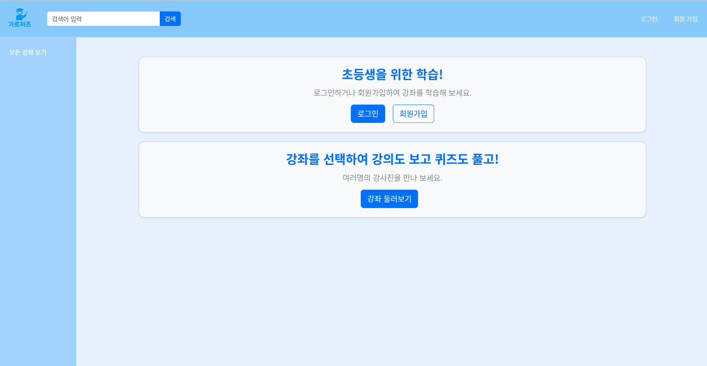
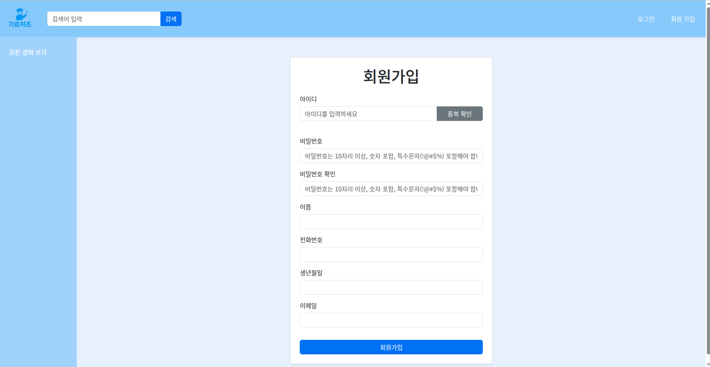
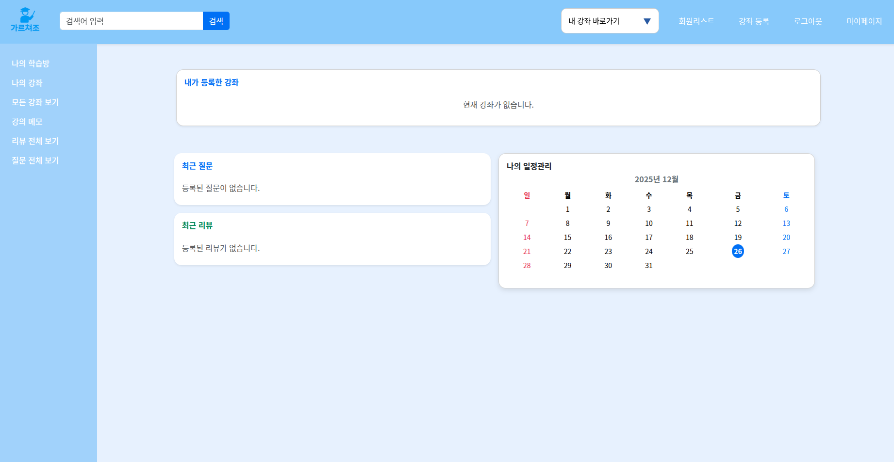
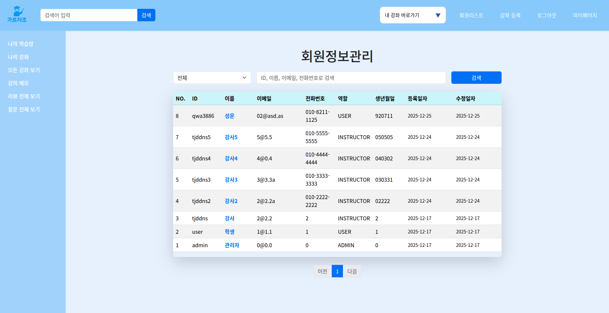
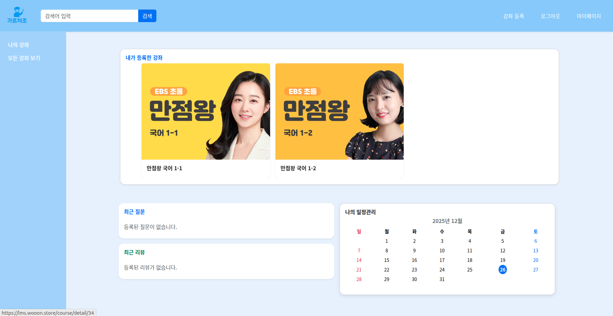
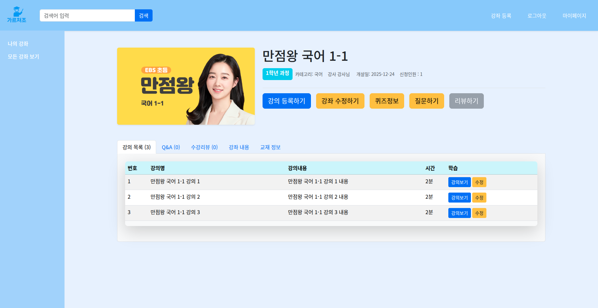
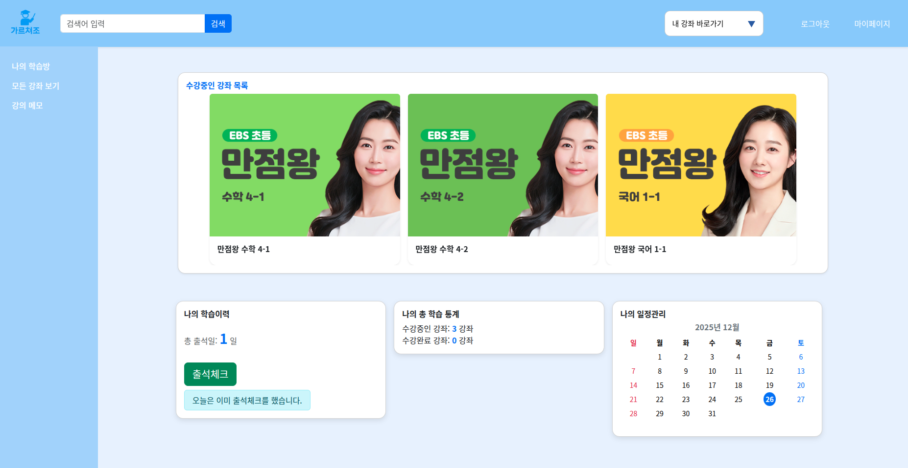
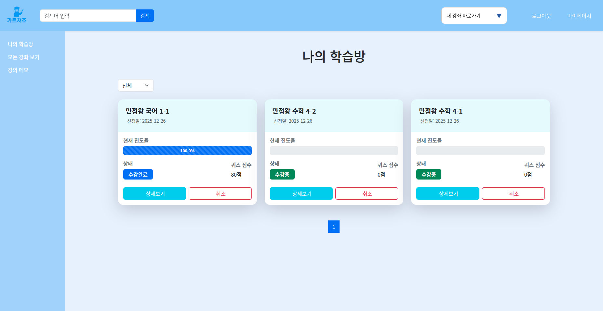
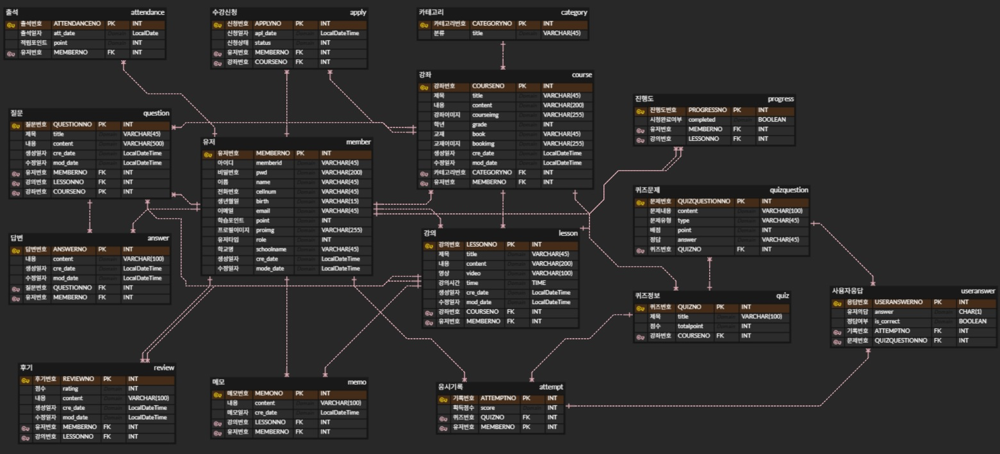
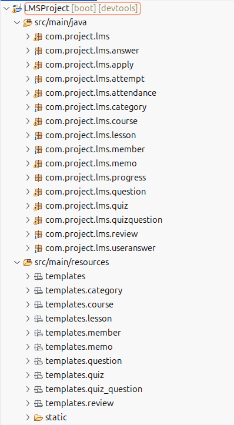

 # 📚 LMS 서비스 개발

초등학생을 위한 **온라인 학습 관리 시스템(LMS)** 프로젝트입니다.  
자기 주도 학습 능력을 기르고, 공교육·사교육을 보조할 수 있는 온라인 학습 환경을 제공합니다.

### 🔗 Service URL
<a href="https://lms.wooon.store" target="_blank" rel="noopener noreferrer">
  https://lms.wooon.store
</a>

---

## 🧩 1. 프로젝트 소개

- **📌 프로젝트 명(팀명)** : 가르쳐조
- **🗓 프로젝트 기간** : 2025.10 ~ 2025.12  
- **👨‍👩‍👧‍👦 팀원** : 김민종, 권미선, 허성운

---

## 🎯 2. 기획 배경

- 🦠 **코로나 이후 대중화된 온라인 학습 환경**
- 🌱 **어릴 때부터 자기 주도 학습 능력 향상 필요**
- 🏫 **학교·학원 과제 및 보충 학습 용도 활용 가능**
- 📖 **공교육·사교육을 보완하는 학습 관리 시스템 필요**

---

## 💡 3. 서비스 소개

- 👦 **초등학생을 위한 학습 관리 시스템(LMS)**
- 🔐 **로그인 후 수강 신청을 통한 온라인 학습 제공**
- 🎓 **출석 체크 기반 포인트 제공**
- 📝 **퀴즈, 메모 기능을 통한 자기 주도 학습 지원**
- 💻 **언제 어디서나 가능한 온라인 수강 학습**

---

## 👥 4. 서비스 대상

- 🧒 **초등학생**
- 👨‍👩‍👧 **학부모**
- 🌐 **온라인 학습을 원하는 사용자 전반**

---

## 🖥 5. 주요 서비스 기능 화면 및 소개
### 1) 첫 번째 페이지
- 모든 강좌 보기
- 로그인, 회원가입

  

### 2) 회원가입 페이지
- 회원가입 페이지
- 아이디 중복 방지, 비밀번호 정규식 사용

  

### 3) 관리자 로그인 시 페이지
- 모든 기능 사용 가능 (모든 권한)
- 좌측 메뉴 리뷰, 후기 전체 조회, 수정, 삭제 가능

  

### 4) 회원 리스트 페이지 (관리자 권한)
- 학생, 강사 전체 리스트 확인 가능
- 역할 별로 정렬 가능
- 학생 -> 강사로 권한 변경 가능

  

### 5) 강사 로그인 시 페이지
- 자신의 강좌 리스트

  

### 6) 강좌 페이지
- 강좌 수정, 삭제 (강사 권한)
- 강의 등록, 수정, 삭제 (강사 권한)
- 퀴즈 등록, 수정, 삭제 (강사 권한)

  

### 7) 학생 로그인 시 페이지
- 수강신청한 강좌 확인
- 출석체크 기능
- 좌측 메뉴 나의 학습방, 메모 확인

  

### 8) 나의 학습방 페이지
- 수강신청한 강좌 확인
- 진도율, 퀴즈 점수, 수강상태 확인

  

### 9) 그 외 기능
- 학생 : 강의 메모 CRUD, 사용자 상세 페이지 (CRUD) 등
- 강사 : 자신의 강좌 수강 신청한 학생 목록 확인 (진도율 등), 자신의 강좌에 대한 학생 퀴즈 기록 확인 등
- 관리자 : 모든 권한 부여 (단, 강좌 삭제를 위해선 수강신청한 학생이 0명이라는 가정 하에 가능)

---

## 🛠 6. 기술 스택

### 🔹 Front-end
- HTML
- CSS
- JavaScript
- Thymeleaf

### 🔹 Back-end
- Java (Spring 기반)

### 🔹 Database
- H2 Console (개발 단계)

### 🔹 Collaboration
- Notion

### 🔹 Development Tool
- STS4 (Spring Tool Suite 4)

---

## 🏗 7. 프로젝트 구조

### 🔹 ERD

  

### 🔹구조

  

---

## 📌 마무리

본 프로젝트는 초등학생(대상)의 자기 주도 학습을 돕기 위한  
온라인 학습 관리 시스템(LMS)으로,  
관리자·강사·학생 역할 기반 기능을 중심으로 설계되었습니다.
